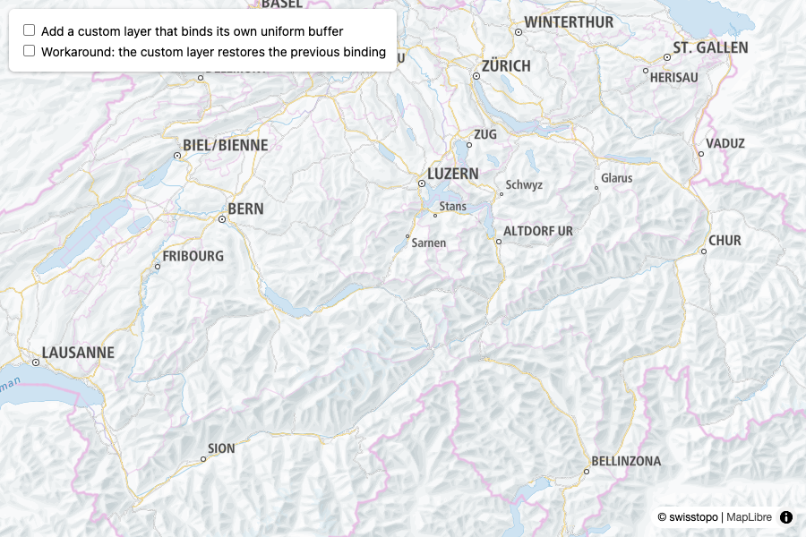
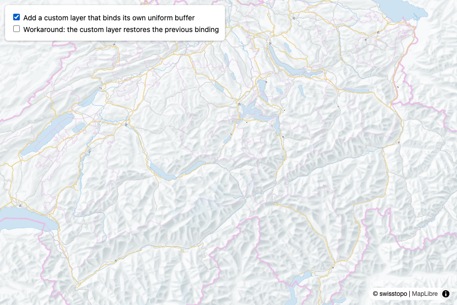
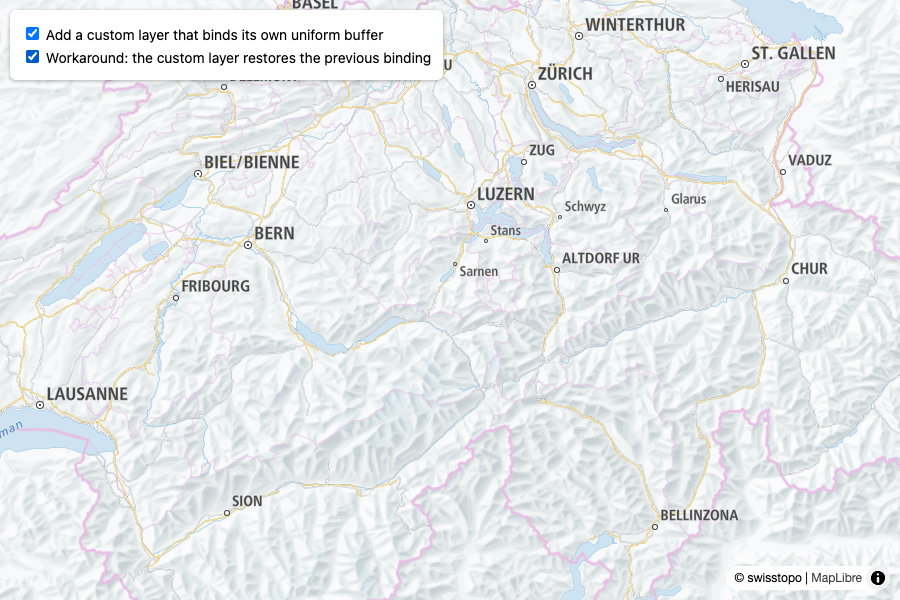
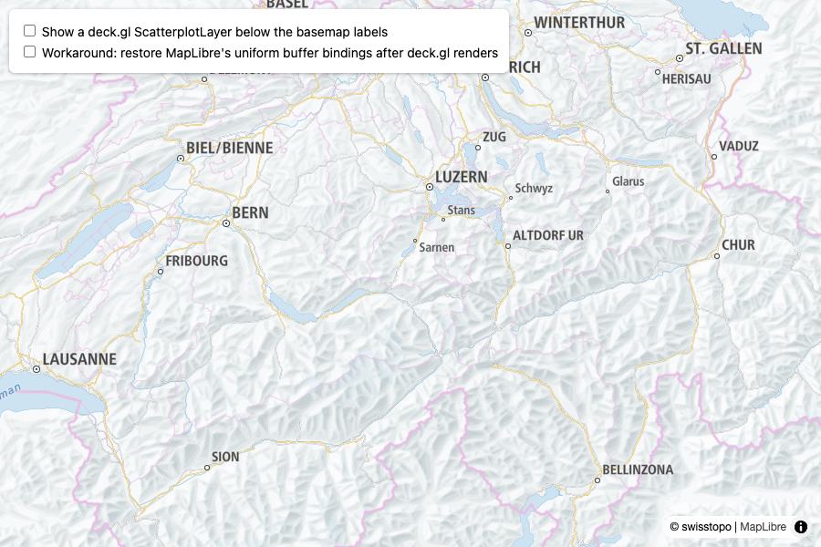
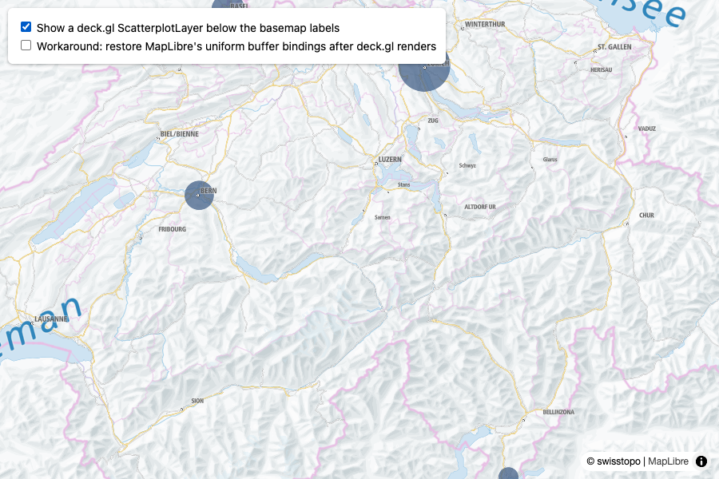
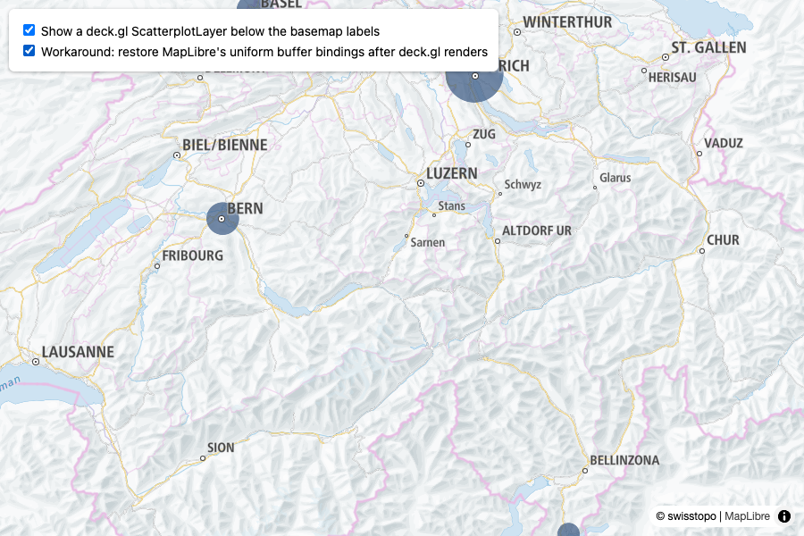

# MapLibre v6: a custom layer that binds a uniform buffer breaks the layers above it

Two minimal reproductions, loaded from unpkg, no bundler.

MapLibre v6 keeps its per-frame uniform block on uniform binding point 2, fills it once per
frame and does not rebind it after a custom layer. Any custom layer that binds its own
uniform buffer there leaves the layers drawn afterwards reading the wrong values. Labels are
the visible casualty.

## `index.html`: MapLibre only

MapLibre GL JS 6.9.0. A custom layer binds its own buffer to binding point 2 and draws
nothing else.

| Before | Custom layer on | Workaround on |
| --- | --- | --- |
|  |  |  |

The workaround checkbox makes the custom layer restore the previous binding after it
renders, using public WebGL calls only.

Reported as <https://github.com/maplibre/maplibre-gl-js/issues/8413>.

## `deckgl.html`: deck.gl MapLibreOverlay, interleaved

deck.gl 9.4.0 and MapLibre GL JS 6.9.0. One ordinary `ScatterplotLayer` rendered interleaved
below the basemap labels. luma.gl binds deck.gl's uniform buffers to the same binding
points, so as soon as the layer is visible the labels drawn after it shrink, grow or vanish.

| Before | deck.gl layer on | Workaround on |
| --- | --- | --- |
|  |  |  |

The workaround checkbox passes `onBeforeRender` / `onAfterRender` props to the overlay that
save and restore the bindings with public WebGL calls only.

## Run locally

Any static file server works, for example:

```sh
python3 -m http.server 8000
```

Then open <http://localhost:8000/>. Opening the files from disk does not work because
MapLibre is imported as an ES module from unpkg.

## Deploy

The folder is a static site. With the Vercel CLI installed:

```sh
vercel
```
